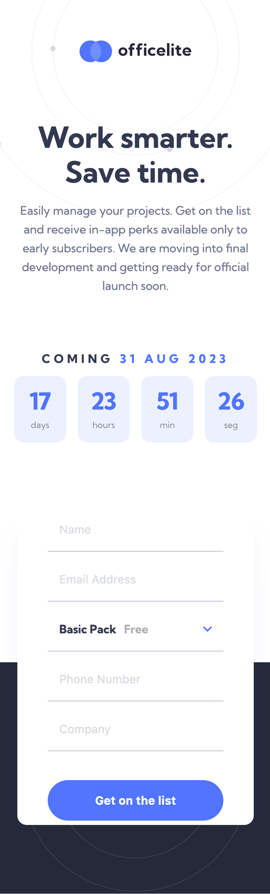

# Frontend Mentor - Officelite coming soon site solution


This is a solution to the [Officelite coming soon site challenge on Frontend Mentor](https://www.frontendmentor.io/challenges/officelite-coming-soon-site-M4DIPNz8g). Frontend Mentor challenges help you improve your coding skills by building realistic projects. 


## Table of contents

- [Overview](#overview)
  - [The challenge](#the-challenge)
  - [Screenshot](#screenshot)
    - [Index Layout](#index-layout)
    - [Sing-Up Layout](#sign-up-layout)
  - [Links](#links)
- [My process](#my-process)
  - [Built with](#built-with)
  - [What I learned](#what-i-learned)
  - [Continued development](#continued-development)
  - [Useful resources](#useful-resources)
- [Author](#author)
- [To-Do](#to-do)

## Overview

### The challenge

Users should be able to:

- View the optimal layout for the site depending on their device's screen size
- See hover states for all interactive elements on the page
- See error states when the contact form is submitted if:
  - The `Name` and/or `Email Address` fields are empty
  - The `Email Address` is not formatted correctly
- **Bonus**: See a live countdown timer that ticks down every second [x]
- **Bonus**: See a custom-styled `select` form control in the sign-up form [x]

### Screenshot
- #### Index Layout
  - #### Desktop
    <p align="center">
      
    </p>

  - #### Tablet
    <p align="center">
      
    </p>

  - #### Mobile
    <p align="center">
      
    </p>

- #### Sign Up Layout
  - #### Desktop
    <p align="center">
      
    </p>

  - #### Tablet
    <p align="center">
      
    </p>

  - #### Mobile
    <p align="center">
      
    </p>

### Links

- Website URL: [Github Page](https://hugosjuarez.github.io/Officelite_Coming_Soon_Site/)

## My process

### Built with

- Semantic HTML5 markup
- CSS custom properties
- Flexbox
- CSS Grid
- Desktop-first workflow
- Vainilla JavaScript

### What I learned

My main focus on the project was to start incorporating JavaScript to a website in order to be able to add dynamic elements like the clock, and sign-up page. This was a greate lerning opportunity since I managed to edit the DOM from the JavaScript files. I learned how to select elements in the DOM and change them for a dynamic look, Regex method for authenticating email, redirecting methods, and even made my personalized select element since this element can't be styled directly:

- Select Elements and change them (Best example was the clock I made):

  ```js
  const releaseDate = new Date("31 August 2023 00:00:00");
  const releaseDateText = document.querySelector(".release-date");
  const releaseDateTextOptions = { day: 'numeric', month: 'short', year: 'numeric'};

  releaseDateText.innerText = (releaseDate.toLocaleDateString("en-GB", releaseDateTextOptions));

  let timeLeft=[]; //[seconds, minutes, hours, days, 1] The last 1 is for it to give me the time left as days 
  let timeAux;
  const timeForEachToPass = [1000, 60, 60, 24];

  function convertMiliToDays(mili) {
      timeLeft=[];
      if (mili<0) {
          timeLeft=["00", "00", "00", "00"];
      }
      else{
          for(let i=0; i<(timeForEachToPass.length-1); i++){
              mili/= timeForEachToPass[i];
              timeAux = Math.floor( mili%timeForEachToPass[i+1] );
              mili-=timeAux;
              timeAux = timeAux.toString();
              timeLeft.push( ( timeAux < 10 ) ? ( "0"+timeAux ) : timeAux );
          }
          
          timeLeft.push(Math.floor(mili/timeForEachToPass[timeForEachToPass.length-1]));
          timeLeft.reverse();
      }
  }


  const timeText = document.querySelectorAll(".number");

  setInterval(()=>{
      let today = new Date();
      convertMiliToDays(releaseDate-today);
      timeText.forEach((text, i)=>{
          text.innerText=timeLeft[i];
      })
  }, 1000)

  ```

- Regex for authentication:

  ```js
  const isValidEmail = (email)=>{
      return email.match(    /^(([^<>()[\]\\.,;:\s@\"]+(\.[^<>()[\]\\.,;:\s@\"]+)*)|(\".+\"))@((\[[0-9]{1,3}\.[0-9]{1,3}\.[0-9]{1,3}\.[0-9]{1,3}\])|(([a-zA-Z\-0-9]+\.)+[a-zA-Z]{2,}))$/ );
  }

  email.addEventListener("change", (e)=>{
      const value = e.target.value; 
      
      if( (!isValidEmail(value)) && (value != "") ) {
          email.parentElement.classList.add("wrong");
      }
      else{
          email.parentElement.classList.remove("wrong");
      }
      
  });
  ```

- Redirecting Method:

  ```js
  buttons.forEach(button =>{
      button.addEventListener("click", ()=>{
          location.href = "sign-up.html";
      });
  });
  ```

- Personalized Select Element: 
  - HTML:
    ```html
      <div class="select">
        <div class="selection-display-box">
          <input type="text" name="package" id="package" value="basic">
          <label id="selection" class="no-highlight" for="package">Basic Pack <span class="cost">Free</span></label>
        </div>
        <ul id="options" class="hidden">
          <li class="option selected-option" data-package="basic">Basic Pack <span class="cost">Free</span></li>
          <li class="option" data-package="pro">Pro Pack <span class="cost">$9.99</span></li>
          <li class="option" data-package="ultimate">Ultimate Pack <span class="cost">$19.99</span></li>
        </ul>
      </div>
    ```

  - JavaScript

    ```js

    // Display and hide options
    selectPackage.forEach(element =>{
        element.addEventListener("click", ()=>{
            optionsMenu.classList.toggle("hidden");
            selectionText.classList.toggle("down");
        });
    });

    // Select default value;
    selectionInput.value="basic";

    // Select an option
    options.forEach(option =>{
        option.addEventListener("click", (e)=>{
            const previousSelectedOption = document.querySelector(".selected-option");
            previousSelectedOption.classList.remove("selected-option");

            const target= e.target;
            target.classList.add("selected-option");
            selectionText.childNodes.forEach((text, i) =>{
                text.textContent = target.childNodes[i].textContent;
            });

            selectionInput.value=target.dataset.package;

            optionsMenu.classList.add("hidden");
        });
    });

    ```

### Continued development

Throughout the challenge in order add events as well as iterate over an array I continued using the forEach method. Which in itself is not a bad solution for the iteration but most of the code could look cleaner and be better for other to understand if I used map, filter and reduce, methods instead. As well as change some uses from arrays to objects.

### Useful resources

- [Abstract Api](https://www.abstractapi.com/guides/email-validation-regex-javascript) - This article explains very well how Regex works and how can it be implemented for validation. It also comments on how you could use an API for the email validation instead which I found out really usefull and open to try in the future.

- [CodingNepal](https://youtu.be/z0avfnlBRto) - This video helped me get an idea of how to create my own styled select element using a list. I only saw him use the list element and didn't continue the video since I wanted to completely make my select element by my own.

## Author

- Website - [Hugo S Juarez P](#to-do)
- Frontend Mentor - [@HugoSJuarez](https://www.frontendmentor.io/profile/HugoSJuarez)
- Linkedin - [Hugo Juarez](https://www.linkedin.com/in/hugo-juarez-934787269/)

## To-Do

- [x] Finish the challenge
- [x] Upload to Github Pages
- [ ] Make portfolio website
- [ ] Upload it to the portfolio website